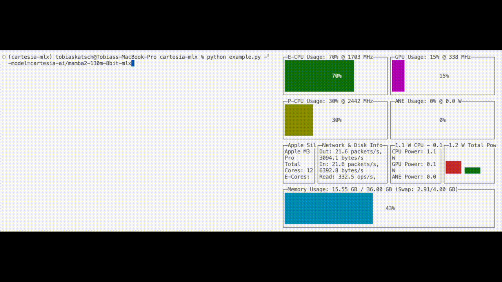

# 📏 Edge

Edge is an open-source library to support the research and release of efficient state space models (SSMs) for on-device applications across multiple accelerators and environments.

Current state-of-the-art models are often too large and slow to run on-device, requiring cloud-based solutions that are expensive and slow. Edge aims to change this by providing a library of efficient SSM models that can run on-device in real-time. 

State-Space Models (SSMs) offer a fundamentally more computationally efficient, yet high quality, approach to building AI models compared to Transformer models. They provide an elegant foundation for training efficient real-time models that can natively stream information with constant tokens per second (tok/s) and memory consumption, making them a game changer for on-device applications.

With Edge, you have:

📏 **Custom inference kernels:** Edge supports custom hardware-specialized inference kernels for SSM architectures, like Mamba

📏 **Local SSM models:** Edge brings together open-weights SSM models and optimizes them for multiple hardware platforms.

## What's New
- **[08/27/2024]**: We are excited to release Edge and our first openly available small language model, [Rene-v0.1](https://huggingface.co/cartesia-ai/Rene-v0.1-1.3b-pytorch). Rene is available with both PyTorch and MLX with quantization support and custom hardware kernels.

## Available Packages
Edge currently hosts packages for multiple backends:
- [`cartesia-pytorch`](cartesia-pytorch/): This package contains the PyTorch implementations of our models and can be used by any hardware where PyTorch is supported (e.g. CPU, CUDA GPU).
- [`cartesia-metal`](cartesia-metal/): This package contains custom metal kernels for fast SSM inference on Apple silicon on laptop and mobile.
- [`cartesia-mlx`](cartesia-mlx/): A Python package containing models to run on [MLX](https://github.com/ml-explore/mlx)

## Run Rene on MLX
For a full list of the available models in MLX and an example of how to run these models, see the [cartesia-mlx README](cartesia-mlx/README.md).

## Looking for custom support from Cartesia?
We got your back! Contact us [here](bit.ly/cartesiaondevice).
