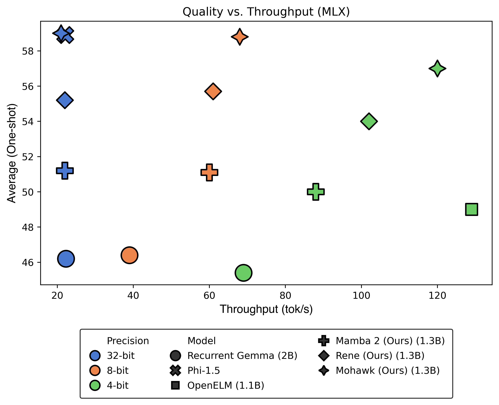
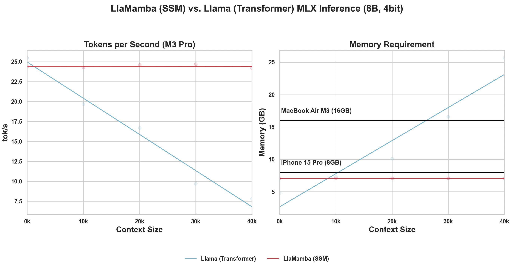

# Cartesia MLX

This package contains implementations for fast on-device SSM inference on Apple silicon. 

## Installation
To install this package, first follow the [installation instructions for `cartesia-metal`](../cartesia-metal/README.md#Installation).
Next (in your Python environment) install the `cartesia-mlx` package:
```shell
pip install cartesia-mlx
```

Note: This package has been tested on macOS Sonoma 14.1 with the M3 chip.

## Models

### Language Models
- `cartesia-ai/Mohawk-v0.1-1.3B-4bit-mlx` 
- `cartesia-ai/LlaMamba-v0.1-8B-Instruct-4bit-mlx` 
- `cartesia-ai/Rene-v0.1-1.3b-4bit-mlx` 
- `cartesia-ai/mamba2-130m-8bit-mlx` 
- `cartesia-ai/mamba2-130m-mlx` 
- `cartesia-ai/mamba2-370m-8bit-mlx` 
- `cartesia-ai/mamba2-780m-8bit-mlx` 
- `cartesia-ai/mamba2-1.3b-4bit-mlx` 
- `cartesia-ai/mamba2-2.7b-4bit-mlx` 

## Usage
A simple example script for generation can be found in `cartesia-mlx/example.py`.
Usage example (clone this repo and run the below from within the `cartesia-mlx` directory):
```shell
python example.py --model cartesia-ai/Mohawk-v0.1-1.3B-4bit-mlx --prompt "Rene Descartes was"
```

## Performance




You can pass any of the models listed above to the `--model` argument; for a full list of command-line options, pass `--help`.

## Rene in MLX

